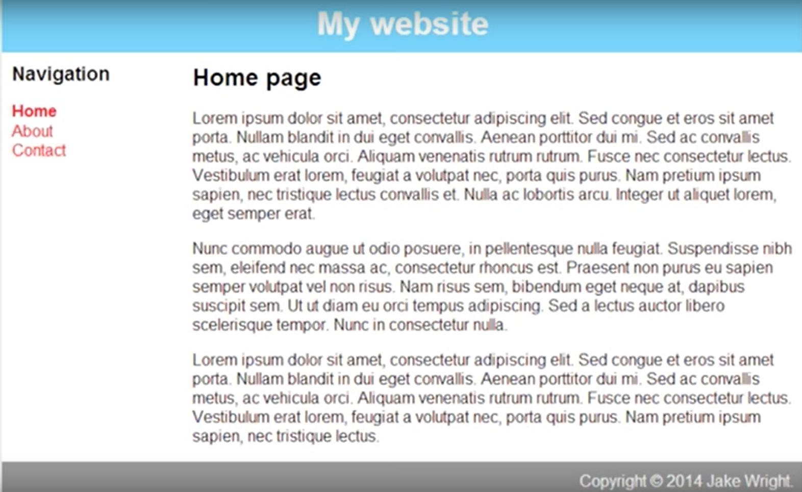

# 1-grid-css
Check how it came out on the ✨[project website][1]✨

## Project description

[Project website at GetAcademy][2]  
Lag en html-side med layout som tegningen deres `(eller bildet over)`  



## Sample Code

Tegn en enkel tegning av en layout - eller bruk denne

```HTML
<!DOCTYPE html>

<html lang="en" xmlns="http://www.w3.org/1999/xhtml">
    <head>
        <meta charset="utf-8" />
        <title></title>
        <style>
            body {
                padding: 0;
                margin: 0;
            }

            div.page {
                height: 100vh;
                display: grid;
                grid-template-columns: 200px 1fr;
                grid-template-rows: 20px 10fr 20px;
                grid-template-areas:
                    "menu header"
                    "menu mainContent"
                    "footer footer";
            }

            div.header {
                background-color: aqua;
                grid-area: header;
            }

            div.menu {
                background-color: aquamarine;
                grid-area: menu;
            }

            div.mainContent {
                background-color: blanchedalmond;
                grid-area: mainContent;
            }

            div.footer {
                background-color: lightgrey;
                grid-area: footer;
            }

            @media only screen and (max-width: 600px) {
                div.page {
                    grid-template-columns: 1fr;
                    grid-template-rows: 20px 1fr 4fr 20px;
                    grid-template-areas:
                        "header"
                        "menu"
                        "mainContent"
                        "footer";
                }
            }
        </style>
    </head>
    <body>
        <div class="page">
            <div class="header">Header</div>
            <div class="menu">Menu</div>
            <div class="mainContent">MainContent</div>
            <div class="footer">Footer</div>
        </div>
    </body>
</html>
```

## Main documentation

- [A Complete Guide to Grid][3]
- [Grid by Example][4]
- [Practice your skills][5] - CSSS grid garden
- [CSS Grid Layout Module][6] - w3schools.com
- [CSS Grid Layout][7] - MDN web docs
- [Can I use][8] - you can check if a given function will work in a your browser [ JS, HTML, CSS, SVG and more ]   

<div align="center">
<a href="http://www.youtube.com/watch?feature=player_embedded&v=Mg43JbvrCWY
" target="_blank"></a>
</div>

## Useful documentation

- [Markdown][9] - I use markdown for this document. Markdown is a lightweight and easy-to-use syntax for styling all forms of writing on the GitHub platform and more.
- [Lorem ipsum generator][10] - fast way to generate test text for website


## Folders structure

```
project
├── graphics  
│   └── layout.png
├── index.html
├── style.css
└── README.md
```


[1]: https://krzysztofga.github.io/1-grid-css/
[2]: https://getacademy.moodlecloud.com/mod/page/view.php?id=357
[3]: https://css-tricks.com/snippets/css/complete-guide-grid/
[4]: https://gridbyexample.com/examples/
[5]: https://cssgridgarden.com/
[6]: https://www.w3schools.com/css/css_grid.asp
[7]: https://developer.mozilla.org/en-US/docs/Web/CSS/CSS_Grid_Layout
[8]: https://caniuse.com/#feat=css-grid
[9]: https://guides.github.com/features/mastering-markdown/
[10]: https://www.lipsum.com/
